# 🚀 Plano de Integração Cloudflare Workers + Transformers

## 📋 Índice

1. [Visão Geral](#visão-geral)
2. [Análise da Estrutura Atual](#análise-da-estrutura-atual)
3. [Arquiteturas Propostas](#arquiteturas-propostas)
4. [Implementação Recomendada](#implementação-recomendada)
5. [Roadmap de Execução](#roadmap-de-execução)
6. [Estrutura de Arquivos](#estrutura-de-arquivos)
7. [Código de Implementação](#código-de-implementação)
8. [Recursos Cloudflare](#recursos-cloudflare)
9. [Custos Estimados](#custos-estimados)
10. [Considerações Legais e SEO](#considerações-legais-e-seo)
11. [Monitoramento e Analytics](#monitoramento-e-analytics)

---

## 🎯 Visão Geral

### Objetivo
Integrar Cloudflare Workers e Transformers (AI) na loja ShopMi Next.js para implementar transformações inteligentes de conteúdo (imagens, textos) com mínima fricção no código existente, visando otimização para motores de busca e crawlers de IA.

### Estratégia Principal
**Abordagem Híbrida (Edge + Origin)**: Manter a aplicação Next.js atual rodando no Netlify e adicionar uma camada de Cloudflare Workers como proxy inteligente na edge, realizando transformações antes de servir o conteúdo.

---

## 📊 Análise da Estrutura Atual

### Stack Tecnológica Identificada

```yaml
Framework: Next.js 14.2.3 (App Router)
Database: PostgreSQL via Prisma Accelerate
Authentication: NextAuth.js v5 (beta)
E-commerce: Shopify Storefront + Admin API
Shipping: Melhor Envio API
Deployment: Netlify
Runtime: Node.js 18
```

### Estrutura de Diretórios Relevante

```
shopmi/
├── src/
│   ├── app/
│   │   ├── api/              # API Routes Next.js
│   │   │   ├── admin/
│   │   │   ├── collections/
│   │   │   ├── products/
│   │   │   └── shipping/
│   │   └── [routes]/         # App Router pages
│   ├── components/           # React components
│   ├── lib/                  # Utilities
│   └── types/                # TypeScript types
├── workers/
│   └── schema.sql           # D1 schema (já existe!)
├── middleware.ts            # Next.js middleware básico
├── next.config.mjs          # Config com image domains
├── netlify.toml             # Deploy atual
└── .env                     # Credenciais
```

### Pontos de Integração Identificados

1. **Imagens**: Configuração atual usa domínios Shopify CDN
   - `cdn.shopify.com`
   - `uxh1te-1d.myshopify.com`
   - Next.js Image Optimization

2. **APIs Existentes**:
   - `/api/products/*` - Catálogo de produtos
   - `/api/collections/*` - Coleções Shopify
   - `/api/admin/*` - Analytics e gestão

3. **Middleware**: Atualmente apenas passa requests através (oportunidade!)

4. **Database**: Já existe schema D1 em `workers/schema.sql`

---

## 🏗️ Arquiteturas Propostas

### Opção 1: Cloudflare Workers como Proxy Inteligente ⭐ **RECOMENDADO**

```mermaid
graph LR
    A[Usuário] --> B[Cloudflare Workers Edge]
    B --> C{Tipo de Request}
    C -->|Imagem| D[CF Images API]
    C -->|Bot/Crawler| E[AI Transformer]
    C -->|Página Dinâmica| F[Next.js Origin Netlify]
    C -->|Static Assets| G[Cache Edge]
    D --> H[Response Otimizada]
    E --> H
    F --> H
    G --> H
```



**Vantagens:**
- ✅ Zero modificação no código Next.js existente
- ✅ Deploy incremental e reversível
- ✅ Mantém infraestrutura atual (Netlify + Prisma)
- ✅ Edge computing para transformações pesadas
- ✅ Custos controlados (paga apenas edge)

**Desvantagens:**
- ⚠️ Adiciona latência mínima (proxy layer)
- ⚠️ Requer configuração de DNS/routing

**Casos de Uso:**
1. **Transformação de Imagens**: Shopify CDN → Cloudflare Images → Otimização automática
2. **SEO Dinâmico**: Páginas de produtos → AI enhancement para bots
3. **Cache Inteligente**: Static assets com TTL adaptativo
4. **Bot Detection**: Servir versões otimizadas para crawlers

---
- Reescrever frontend completo
- Perda de funcionalidades React/Next.js
- Alto esforço sem benefício proporcional

---

## 🚀 Implementação Recomendada: Opção 1 (Hybrid Edge)

### Fase 1: Setup Inicial (Dias 1-2)

#### 1.1 Instalar Wrangler CLI

```bash
cd shopmi
mkdir -p workers
cd workers
npm init -y
npm install -D wrangler @cloudflare/workers-types typescript
npm install hono @hono/node-server
```

#### 1.2 Criar Estrutura de Arquivos

```bash
workers/
├── package.json
├── tsconfig.json
├── wrangler.toml
└── src/
    ├── index.ts              # Entry point principal
    ├── image-transform.ts    # Cloudflare Images integration
    ├── ai-transform.ts       # Workers AI transformers
    ├── bot-detection.ts      # User-Agent analysis
    ├── cache-strategy.ts     # Edge caching logic
    ├── analytics.ts          # D1 logging
    └── types.ts              # TypeScript definitions
```

#### 1.3 Configurar wrangler.toml

```toml
name = "shopmi-edge"
main = "src/index.ts"
compatibility_date = "2024-10-20"
workers_dev = true

# Account settings
account_id = "SEU_ACCOUNT_ID"

# Production environment
[env.production]
name = "shopmi-edge-production"
route = { pattern = "suaoja.com/*", zone_name = "suaoja.com" }

# Development environment
[env.development]
name = "shopmi-edge-dev"

# Environment variables
[vars]
ORIGIN_URL = "https://seu-site.netlify.app"
SHOPIFY_DOMAIN = "uxh1te-1d.myshopify.com"

# Secrets (configure via wrangler secret put)
# CF_IMAGES_TOKEN
# CF_ACCOUNT_HASH

# Workers AI binding
[ai]
binding = "AI"

# KV namespace for cache
[[kv_namespaces]]
binding = "CACHE"
id = "SEU_KV_ID"
preview_id = "SEU_KV_PREVIEW_ID"

# D1 database for analytics
[[d1_databases]]
binding = "DB"
database_name = "shopmi_analytics"
database_id = "SEU_D1_ID"

# R2 bucket for image cache (opcional)
[[r2_buckets]]
binding = "IMAGES"
bucket_name = "shopmi-images"
preview_bucket_name = "shopmi-images-preview"
```

---

### Fase 2: Image Transformation (Dias 3-5)

#### 2.1 Implementar Cloudflare Images API

**Arquivo: `workers/src/image-transform.ts`**

```typescript
import { Env } from './types';

export interface ImageTransformOptions {
  width?: number;
  height?: number;
  quality?: number;
  format?: 'auto' | 'webp' | 'avif' | 'jpeg';
  fit?: 'scale-down' | 'contain' | 'cover' | 'crop' | 'pad';
}

export async function transformImage(
  request: Request,
  env: Env,
  isBot: boolean
): Promise<Response> {
  const url = new URL(request.url);

  // Extrair URL original da imagem
  const imageUrl = extractImageUrl(url);
  if (!imageUrl) {
    return fetch(request); // Fallback para origin
  }

  // Parâmetros de transformação
  const options: ImageTransformOptions = {
    width: parseInt(url.searchParams.get('w') || '1200'),
    quality: isBot ? 60 : 85, // Menor qualidade para bots
    format: 'auto', // WebP/AVIF automático
    fit: 'scale-down'
  };

  // Cache key único
  const cacheKey = `img:${imageUrl}:${JSON.stringify(options)}`;

  // Verificar cache KV
  const cached = await env.CACHE.get(cacheKey, { type: 'arrayBuffer' });
  if (cached) {
    return new Response(cached, {
      headers: {
        'Content-Type': 'image/webp',
        'Cache-Control': 'public, max-age=31536000, immutable',
        'X-Cache': 'HIT'
      }
    });
  }

  // Transformar via Cloudflare Images
  const transformedUrl = buildCloudflareImageUrl(imageUrl, options, env);
  const response = await fetch(transformedUrl);

  if (!response.ok) {
    return fetch(request); // Fallback
  }

  // Armazenar em cache
  const imageData = await response.arrayBuffer();
  await env.CACHE.put(cacheKey, imageData, {
    expirationTtl: 86400 * 30 // 30 dias
  });

  return new Response(imageData, {
    headers: {
      'Content-Type': response.headers.get('Content-Type') || 'image/webp',
      'Cache-Control': 'public, max-age=31536000, immutable',
      'X-Cache': 'MISS'
    }
  });
}

function buildCloudflareImageUrl(
  originalUrl: string,
  options: ImageTransformOptions,
  env: Env
): string {
  // Cloudflare Images URL format
  const baseUrl = `https://imagedelivery.net/${env.CF_ACCOUNT_HASH}`;

  // Encode original URL como identifier
  const imageId = btoa(originalUrl).replace(/=/g, '');

  // Build transformation parameters
  const params = [
    options.width && `w=${options.width}`,
    options.height && `h=${options.height}`,
    options.quality && `q=${options.quality}`,
    options.format && `f=${options.format}`,
    options.fit && `fit=${options.fit}`
  ].filter(Boolean).join(',');

  return `${baseUrl}/${imageId}/${params}`;
}

function extractImageUrl(url: URL): string | null {
  // Caso 1: Proxy de imagem Shopify
  if (url.pathname.startsWith('/_img/')) {
    return decodeURIComponent(url.pathname.replace('/_img/', ''));
  }

  // Caso 2: Query parameter
  if (url.searchParams.has('url')) {
    return url.searchParams.get('url')!;
  }

  return null;
}
```

#### 2.2 Integração com Next.js Image

**Modificar: `next.config.mjs`**

```javascript
const nextConfig = {
  images: {
    loader: 'custom',
    loaderFile: './src/lib/image-loader.ts',
    domains: [
      'i01.appmifile.com',
      'placehold.co',
      'cdn.shopify.com',
      'uxh1te-1d.myshopify.com',
      'suaoja.com' // Seu domínio com Workers
    ],
  },
  // ... resto da config
};
```

**Criar: `src/lib/image-loader.ts`**

```typescript
export default function cloudflareLoader({ src, width, quality }: {
  src: string;
  width: number;
  quality?: number;
}) {
  // Se já for URL absoluta externa, usar proxy
  if (src.startsWith('http')) {
    const params = new URLSearchParams({
      url: src,
      w: width.toString(),
      q: (quality || 85).toString()
    });
    return `/_img?${params.toString()}`;
  }

  // Imagens locais
  return `${src}?w=${width}&q=${quality || 85}`;
}
```

---

### Fase 3: AI Transformers para SEO (Dias 6-10)

#### 3.1 Bot Detection

**Arquivo: `workers/src/bot-detection.ts`**

```typescript
export interface BotInfo {
  isBot: boolean;
  type: 'googlebot' | 'bingbot' | 'crawler' | 'ai-scraper' | 'user';
  verified: boolean;
  trustScore: number;
}

const KNOWN_BOTS = {
  googlebot: {
    userAgents: ['Googlebot', 'Google-InspectionTool'],
    ipRanges: ['66.249.64.0/19', '64.233.160.0/19'] // Simplified
  },
  bingbot: {
    userAgents: ['bingbot', 'msnbot'],
    ipRanges: ['40.77.167.0/24', '207.46.13.0/24']
  },
  crawler: {
    userAgents: ['Slurp', 'DuckDuckBot', 'Baiduspider', 'YandexBot']
  },
  aiScraper: {
    userAgents: ['GPTBot', 'ChatGPT-User', 'ClaudeBot', 'anthropic-ai']
  }
};

export function detectBot(request: Request): BotInfo {
  const ua = request.headers.get('User-Agent') || '';
  const ip = request.headers.get('CF-Connecting-IP') || '';

  // Detectar tipo de bot
  for (const [type, config] of Object.entries(KNOWN_BOTS)) {
    for (const pattern of config.userAgents) {
      if (ua.includes(pattern)) {
        return {
          isBot: true,
          type: type as BotInfo['type'],
          verified: verifyBotIP(ip, config.ipRanges),
          trustScore: calculateTrustScore(request, type)
        };
      }
    }
  }

  // Heurística adicional
  const suspiciousPatterns = [
    /bot|crawler|spider|scraper/i,
    /curl|wget|python-requests/i,
    /headless|phantom|selenium/i
  ];

  const isSuspicious = suspiciousPatterns.some(p => p.test(ua));

  return {
    isBot: isSuspicious,
    type: 'crawler',
    verified: false,
    trustScore: isSuspicious ? 0.3 : 1.0
  };
}

function verifyBotIP(ip: string, ranges?: string[]): boolean {
  if (!ranges) return false;

  // Verificação simplificada - em produção usar biblioteca CIDR
  // ou reverse DNS lookup para verificar bots oficiais
  return ranges.some(range => ip.startsWith(range.split('/')[0].slice(0, -2)));
}

function calculateTrustScore(request: Request, botType: string): number {
  let score = 0.5;

  // Bots verificados têm score alto
  if (botType === 'googlebot' || botType === 'bingbot') {
    score = 0.9;
  }

  // Verificar headers legítimos
  const hasReferer = request.headers.has('Referer');
  const hasAccept = request.headers.has('Accept');
  const hasAcceptLanguage = request.headers.has('Accept-Language');

  if (hasReferer) score += 0.1;
  if (hasAccept) score += 0.1;
  if (hasAcceptLanguage) score += 0.1;

  return Math.min(score, 1.0);
}
```

#### 3.2 AI Content Enhancement

**Arquivo: `workers/src/ai-transform.ts`**

```typescript
import { Env, BotInfo } from './types';

export async function enhanceSEOContent(
  originResponse: Response,
  env: Env,
  bot: BotInfo
): Promise<Response> {
  // Apenas para bots verificados de alta confiança
  if (!bot.isBot || bot.trustScore < 0.7) {
    return originResponse;
  }

  const html = await originResponse.text();

  // Extrair dados estruturados da página
  const pageData = extractPageData(html);

  // Cache key para AI transformations
  const cacheKey = `ai:${pageData.url}:${bot.type}`;
  const cached = await env.CACHE.get(cacheKey);

  if (cached) {
    return new Response(cached, {
      headers: originResponse.headers
    });
  }

  // Gerar conteúdo otimizado com Workers AI
  const aiEnhancements = await generateSEOEnhancements(pageData, bot, env);

  // Injetar melhorias no HTML
  const enhancedHtml = injectEnhancements(html, aiEnhancements);

  // Cachear resultado
  await env.CACHE.put(cacheKey, enhancedHtml, {
    expirationTtl: 86400 * 7 // 7 dias
  });

  // Registrar analytics
  await logTransformation(env.DB, {
    url: pageData.url,
    botType: bot.type,
    timestamp: Date.now()
  });

  return new Response(enhancedHtml, {
    headers: originResponse.headers
  });
}

async function generateSEOEnhancements(
  pageData: PageData,
  bot: BotInfo,
  env: Env
) {
  // Usar Workers AI (Llama 2) para gerar conteúdo
  const prompt = `
Você é um expert em SEO. Analise o seguinte produto e gere:
1. Uma meta description única e persuasiva (máx 155 caracteres)
2. Tags de palavras-chave relevantes
3. Texto alternativo para imagens

Produto: ${pageData.title}
Descrição: ${pageData.description}
Preço: ${pageData.price}

Responda em JSON válido.
  `.trim();

  const aiResponse = await env.AI.run('@cf/meta/llama-2-7b-chat-int8', {
    prompt,
    max_tokens: 256,
    temperature: 0.7
  });

  let enhancements;
  try {
    enhancements = JSON.parse(aiResponse.response);
  } catch {
    // Fallback para extração manual
    enhancements = {
      metaDescription: pageData.description?.slice(0, 155),
      keywords: extractKeywords(pageData.description || ''),
      imageAlt: `${pageData.title} - Foto do produto`
    };
  }

  // Gerar Schema.org JSON-LD específico por tipo de bot
  const schema = generateSchemaOrg(pageData, bot);

  return {
    ...enhancements,
    schema
  };
}

function generateSchemaOrg(pageData: PageData, bot: BotInfo) {
  const schema = {
    '@context': 'https://schema.org',
    '@type': 'Product',
    name: pageData.title,
    description: pageData.description,
    image: pageData.images,
    offers: {
      '@type': 'Offer',
      price: pageData.price,
      priceCurrency: 'BRL',
      availability: 'https://schema.org/InStock',
      url: pageData.url
    }
  };

  // Adicionar campos extras para Google
  if (bot.type === 'googlebot') {
    schema.brand = {
      '@type': 'Brand',
      name: 'Xiaomi'
    };
    schema.aggregateRating = pageData.rating ? {
      '@type': 'AggregateRating',
      ratingValue: pageData.rating,
      reviewCount: pageData.reviewCount || 1
    } : undefined;
  }

  return schema;
}

function injectEnhancements(html: string, enhancements: any): string {
  let enhanced = html;

  // 1. Injetar/atualizar meta description
  if (enhancements.metaDescription) {
    const metaTag = `<meta name="description" content="${escapeHtml(enhancements.metaDescription)}">`;

    if (html.includes('<meta name="description"')) {
      enhanced = enhanced.replace(
        /<meta name="description"[^>]*>/,
        metaTag
      );
    } else {
      enhanced = enhanced.replace('</head>', `${metaTag}\n</head>`);
    }
  }

  // 2. Injetar Schema.org JSON-LD
  if (enhancements.schema) {
    const schemaScript = `
<script type="application/ld+json">
${JSON.stringify(enhancements.schema, null, 2)}
</script>`;
    enhanced = enhanced.replace('</head>', `${schemaScript}\n</head>`);
  }

  // 3. Adicionar meta keywords (ainda útil para alguns crawlers)
  if (enhancements.keywords) {
    const keywordsTag = `<meta name="keywords" content="${enhancements.keywords.join(', ')}">`;
    enhanced = enhanced.replace('</head>', `${keywordsTag}\n</head>`);
  }

  return enhanced;
}

interface PageData {
  url: string;
  title: string;
  description?: string;
  price?: string;
  images?: string[];
  rating?: number;
  reviewCount?: number;
}

function extractPageData(html: string): PageData {
  // Parse HTML básico - em produção usar parser robusto
  const titleMatch = html.match(/<title>(.*?)<\/title>/i);
  const descMatch = html.match(/<meta name="description" content="(.*?)"/i);

  return {
    url: '',
    title: titleMatch?.[1] || 'Produto',
    description: descMatch?.[1],
    images: extractImages(html)
  };
}

function extractImages(html: string): string[] {
  const imgRegex = /]+src="([^">]+)"/g;
  const images: string[] = [];
  let match;

  while ((match = imgRegex.exec(html)) !== null) {
    images.push(match[1]);
  }

  return images.slice(0, 5); // Limitar a 5 imagens
}

function extractKeywords(text: string): string[] {
  // Extração simples - em produção usar NLP
  const words = text.toLowerCase()
    .split(/\s+/)
    .filter(w => w.length > 4)
    .slice(0, 10);

  return [...new Set(words)];
}

function escapeHtml(text: string): string {
  return text
    .replace(/&/g, '&amp;')
    .replace(/</g, '&lt;')
    .replace(/>/g, '&gt;')
    .replace(/"/g, '&quot;')
    .replace(/'/g, '&#039;');
}

async function logTransformation(db: D1Database, data: any) {
  try {
    await db.prepare(`
      INSERT INTO transformations (url, bot_type, timestamp)
      VALUES (?, ?, ?)
    `).bind(data.url, data.botType, data.timestamp).run();
  } catch (error) {
    console.error('Failed to log transformation:', error);
  }
}
```

---

### Fase 4: Worker Principal (Dias 11-12)

**Arquivo: `workers/src/index.ts`**

```typescript
import { transformImage } from './image-transform';
import { enhanceSEOContent } from './ai-transform';
import { detectBot } from './bot-detection';
import { Env } from './types';

export default {
  async fetch(
    request: Request,
    env: Env,
    ctx: ExecutionContext
  ): Promise<Response> {
    const url = new URL(request.url);

    // Detectar bot
    const botInfo = detectBot(request);

    // ============================================
    // ROUTE 1: Image Transformation
    // ============================================
    if (url.pathname.startsWith('/_img')) {
      return transformImage(request, env, botInfo.isBot);
    }

    // Também capturar imagens Shopify diretas
    if (url.hostname.includes('cdn.shopify.com') ||
        url.hostname.includes('myshopify.com')) {
      return transformImage(request, env, botInfo.isBot);
    }

    // ============================================
    // ROUTE 2: Static Assets (Cache Agressivo)
    // ============================================
    if (url.pathname.startsWith('/_next/static/')) {
      const cache = caches.default;
      let response = await cache.match(request);

      if (!response) {
        response = await fetch(request);
        if (response.ok) {
          response = new Response(response.body, response);
          response.headers.set('Cache-Control', 'public, max-age=31536000, immutable');
          ctx.waitUntil(cache.put(request, response.clone()));
        }
      }

      return response;
    }

    // ============================================
    // ROUTE 3: AI Enhancement para Bots em Páginas de Produto
    // ============================================
    if (botInfo.isBot &&
        botInfo.trustScore > 0.6 &&
        url.pathname.startsWith('/products/')) {

      // Fetch from origin
      const originUrl = `${env.ORIGIN_URL}${url.pathname}${url.search}`;
      const originResponse = await fetch(originUrl, {
        headers: request.headers
      });

      // Aplicar AI transformations
      return enhanceSEOContent(originResponse, env, botInfo);
    }

    // ============================================
    // ROUTE 4: API Routes (Proxy Direto)
    // ============================================
    if (url.pathname.startsWith('/api/')) {
      const originUrl = `${env.ORIGIN_URL}${url.pathname}${url.search}`;
      return fetch(originUrl, request);
    }

    // ============================================
    // DEFAULT: Proxy para Origin (Next.js)
    // ============================================
    const originUrl = `${env.ORIGIN_URL}${url.pathname}${url.search}`;
    const originRequest = new Request(originUrl, request);

    return fetch(originRequest);
  }
};
```

**Arquivo: `workers/src/types.ts`**

```typescript
export interface Env {
  // Workers AI binding
  AI: any;

  // KV namespace for cache
  CACHE: KVNamespace;

  // D1 database
  DB: D1Database;

  // R2 bucket (opcional)
  IMAGES?: R2Bucket;

  // Environment variables
  ORIGIN_URL: string;
  SHOPIFY_DOMAIN: string;
  CF_ACCOUNT_HASH: string;
  CF_IMAGES_TOKEN: string;
}

export interface BotInfo {
  isBot: boolean;
  type: 'googlebot' | 'bingbot' | 'crawler' | 'ai-scraper' | 'user';
  verified: boolean;
  trustScore: number;
}

export interface ImageTransformOptions {
  width?: number;
  height?: number;
  quality?: number;
  format?: 'auto' | 'webp' | 'avif' | 'jpeg';
  fit?: 'scale-down' | 'contain' | 'cover' | 'crop' | 'pad';
}
```

---

### Fase 5: Database e Analytics (Dia 13)

**Atualizar: `workers/schema.sql`**

```sql
-- Schema existente + tabelas de analytics

-- Tabela de transformações (analytics)
CREATE TABLE IF NOT EXISTS transformations (
  id INTEGER PRIMARY KEY AUTOINCREMENT,
  url TEXT NOT NULL,
  bot_type TEXT NOT NULL,
  timestamp INTEGER NOT NULL,
  response_time INTEGER,
  cache_hit BOOLEAN DEFAULT FALSE
);

CREATE INDEX idx_transformations_timestamp ON transformations(timestamp);
CREATE INDEX idx_transformations_bot_type ON transformations(bot_type);

-- Tabela de cache metadata
CREATE TABLE IF NOT EXISTS cache_metadata (
  key TEXT PRIMARY KEY,
  url TEXT NOT NULL,
  size INTEGER,
  created_at INTEGER NOT NULL,
  expires_at INTEGER NOT NULL,
  hit_count INTEGER DEFAULT 0
);

CREATE INDEX idx_cache_expires ON cache_metadata(expires_at);

-- View de analytics
CREATE VIEW IF NOT EXISTS analytics_summary AS
SELECT
  DATE(timestamp / 1000, 'unixepoch') as date,
  bot_type,
  COUNT(*) as total_requests,
  AVG(response_time) as avg_response_time,
  SUM(CASE WHEN cache_hit THEN 1 ELSE 0 END) as cache_hits,
  CAST(SUM(CASE WHEN cache_hit THEN 1 ELSE 0 END) AS REAL) / COUNT(*) * 100 as cache_hit_rate
FROM transformations
GROUP BY DATE(timestamp / 1000, 'unixepoch'), bot_type
ORDER BY date DESC;
```

**Criar Database:**

```bash
# Criar D1 database
npx wrangler d1 create shopmi-analytics

# Executar schema
npx wrangler d1 execute shopmi-analytics --file=./schema.sql --remote

# Testar
npx wrangler d1 execute shopmi-analytics --command="SELECT * FROM transformations LIMIT 10" --remote
```

---

### Fase 6: Deploy e Configuração (Dias 14-15)

#### 6.1 Configurar Secrets

```bash
# Cloudflare Images
npx wrangler secret put CF_IMAGES_TOKEN
# Cole seu token quando solicitado

npx wrangler secret put CF_ACCOUNT_HASH
# Cole o hash da sua conta
```

#### 6.2 Deploy para Staging

```bash
# Deploy para ambiente de desenvolvimento
npx wrangler deploy --env development

# Testar
curl https://shopmi-edge-dev.YOUR_SUBDOMAIN.workers.dev
```

#### 6.3 Configurar DNS

1. Adicionar domínio à Cloudflare (se ainda não estiver)
2. Criar Worker Route:
   - Pattern: `suaoja.com/*`
   - Worker: `shopmi-edge-production`

3. Ou usar Cloudflare Tunnel para testes:

```bash
npx wrangler pages deployment tail
```

#### 6.4 Deploy para Produção

```bash
# Deploy production
npx wrangler deploy --env production

# Verificar
npx wrangler tail --env production
```

---

## 📁 Estrutura de Arquivos Completa

```
shopmi/
├── src/                          # Next.js (existente - sem mudanças)
│   ├── app/
│   ├── components/
│   ├── lib/
│   │   └── image-loader.ts      # ⭐ NOVO: Custom image loader
│   └── types/
├── workers/                      # ⭐ NOVO: Cloudflare Workers
│   ├── package.json
│   ├── tsconfig.json
│   ├── wrangler.toml
│   ├── schema.sql               # Atualizado com analytics
│   └── src/
│       ├── index.ts             # Entry point
│       ├── image-transform.ts   # Cloudflare Images
│       ├── ai-transform.ts      # Workers AI
│       ├── bot-detection.ts     # Bot detection
│       ├── cache-strategy.ts    # Cache logic
│       ├── analytics.ts         # D1 analytics
│       └── types.ts             # TypeScript types
├── next.config.mjs              # ⭐ MODIFICAR: Custom loader
├── middleware.ts                # (Opcional atualizar)
├── netlify.toml                 # Mantém deploy atual
└── CLOUDFLARE_INTEGRATION_PLAN.md  # Este documento
```

---

## 💰 Custos Estimados Cloudflare

### Workers (Free Tier)
- **100.000 requests/dia GRÁTIS**
- Acima: $0.50 por milhão de requests
- **Estimativa**: Gratuito para tráfego médio

### Workers AI
- **10.000 neurons/dia GRÁTIS**
- Acima: $0.011 por 1.000 neurons
- 1 request = ~100 neurons (Llama 2)
- **Estimativa**: $5-20/mês (1000-5000 transformações/dia)

### Cloudflare Images
- **100.000 imagens armazenadas**: $5/mês
- **100.000 transformações**: Incluídas
- Acima: $1 por 1.000 imagens extras
- **Estimativa**: $5-15/mês

### D1 Database
- **5 milhões reads/mês**: GRÁTIS
- **100.000 writes/mês**: GRÁTIS
- **Estimativa**: Gratuito

### KV Storage
- **1 GB**: GRÁTIS
- **10 milhões reads/mês**: GRÁTIS
- **Estimativa**: Gratuito

### R2 Storage (Opcional)
- **10 GB/mês**: GRÁTIS
- **Estimativa**: Gratuito

### **TOTAL MENSAL ESTIMADO: $10-35/mês**

Comparado com:
- Netlify atual: $0-19/mês
- **Custo adicional total**: ~$10-35/mês

---

## 📊 Recursos Cloudflare Utilizados

### 1. **Cloudflare Workers**
- Runtime V8 isolates
- Edge computing (distribuído globalmente)
- Latência <50ms
- Executa em 200+ cidades

### 2. **Workers AI**
Modelos disponíveis:
- `@cf/meta/llama-2-7b-chat-int8` - Geração de texto
- `@cf/huggingface/distilbert-sst-2-int8` - Análise de sentimento
- `@cf/baai/bge-base-en-v1.5` - Embeddings
- `@cf/stabilityai/stable-diffusion-xl-base-1.0` - Geração de imagens

### 3. **Cloudflare Images**
Features:
- Resize automático
- Formato moderno (WebP/AVIF)
- Lazy loading
- Cache global
- Watermark opcional

### 4. **D1 Database**
- SQLite distribuído
- Edge locations
- Leitura rápida (write eventual consistency)
- SQL padrão

### 5. **KV Storage**
- Key-Value store
- Edge cache
- TTL automático
- Eventual consistency global

### 6. **R2 Storage** (Opcional)
- Object storage S3-compatible
- Sem egress fees
- Upload direto via Workers

---

## ⚖️ Considerações Legais e SEO

### ⚠️ Cloaking: O Que é Permitido

**PERMITIDO** ✅:
1. **Performance Optimization**
   - Servir imagens menores para bots
   - Remover JavaScript desnecessário para crawlers
   - Comprimir HTML para bots

2. **Enhanced Structured Data**
   - Adicionar Schema.org para crawlers
   - Melhorar meta tags para bots específicos
   - Fornecer sitemap XML otimizado

3. **Accessibility**
   - Versões simplificadas para screen readers
   - Alt text melhorado para bots

**PROIBIDO** ❌:
1. **Deceptive Content**
   - Mostrar conteúdo diferente para usuários vs bots
   - Esconder texto/links para usuários mas mostrar para bots
   - Redirecionar bots para páginas diferentes

2. **Spam Techniques**
   - Keyword stuffing apenas para bots
   - Doorway pages
   - Cloaking malicioso

### Google Webmaster Guidelines

> "Don't show different content to search engines than to users. This is called cloaking and is against our guidelines."

**Nossa Implementação:**
- ✅ Mesmo conteúdo HTML base
- ✅ Apenas otimizações de performance
- ✅ Estruturação de dados melhorada (Schema.org)
- ✅ Imagens otimizadas (menor qualidade, não conteúdo diferente)

### Recomendações de Uso

1. **Transparência**: Documentar todas transformações
2. **Testes**: Usar Google Search Console para verificar como Google vê a página
3. **Monitoramento**: Acompanhar posicionamento e penalizações
4. **Reversibilidade**: Poder desligar transformações rapidamente

---

## 📈 Monitoramento e Analytics

### 1. Dashboard D1 (Analytics Próprio)

**Criar: `workers/src/analytics.ts`**

```typescript
export async function getAnalyticsSummary(db: D1Database, days: number = 7) {
  const result = await db.prepare(`
    SELECT
      bot_type,
      COUNT(*) as total_requests,
      AVG(response_time) as avg_response_time,
      SUM(CASE WHEN cache_hit THEN 1 ELSE 0 END) as cache_hits,
      CAST(SUM(CASE WHEN cache_hit THEN 1 ELSE 0 END) AS REAL) / COUNT(*) * 100 as cache_hit_rate
    FROM transformations
    WHERE timestamp > ?
    GROUP BY bot_type
    ORDER BY total_requests DESC
  `).bind(Date.now() - (days * 86400 * 1000)).all();

  return result.results;
}
```

**API Endpoint para Dashboard:**

```typescript
// workers/src/index.ts - adicionar route
if (url.pathname === '/api/analytics') {
  const summary = await getAnalyticsSummary(env.DB, 7);
  return Response.json(summary);
}
```

### 2. Cloudflare Analytics (Built-in)

Métricas disponíveis:
- Requests por segundo
- Bandwidth usage
- Error rate
- CPU time
- Memory usage

Acesso: Dashboard Cloudflare → Workers → Metrics

### 3. Logs em Tempo Real

```bash
# Tail logs production
npx wrangler tail --env production

# Filtrar por status
npx wrangler tail --env production --status error

# Filtrar por IP
npx wrangler tail --env production --ip 1.2.3.4
```

### 4. Integração com External Tools

**Exemplo: Send para PostHog**

```typescript
async function trackEvent(event: string, properties: any) {
  await fetch('https://app.posthog.com/capture/', {
    method: 'POST',
    headers: { 'Content-Type': 'application/json' },
    body: JSON.stringify({
      api_key: 'YOUR_POSTHOG_KEY',
      event,
      properties,
      timestamp: new Date().toISOString()
    })
  });
}

// Usar em transformations
await trackEvent('image_transformed', {
  bot_type: botInfo.type,
  original_size: originalSize,
  transformed_size: transformedSize,
  format: 'webp'
});
```

---

## 🧪 Testing Strategy

### 1. Unit Tests (Vitest)

```bash
cd workers
npm install -D vitest @cloudflare/vitest-pool-workers
```

**Criar: `workers/vitest.config.ts`**

```typescript
import { defineConfig } from 'vitest/config';

export default defineConfig({
  test: {
    globals: true,
    environment: 'miniflare',
    environmentOptions: {
      kvNamespaces: ['CACHE'],
      d1Databases: ['DB'],
      bindings: {
        ORIGIN_URL: 'https://test.example.com'
      }
    }
  }
});
```

**Exemplo de teste:**

```typescript
// workers/src/__tests__/bot-detection.test.ts
import { describe, it, expect } from 'vitest';
import { detectBot } from '../bot-detection';

describe('detectBot', () => {
  it('should detect Googlebot', () => {
    const request = new Request('https://example.com', {
      headers: {
        'User-Agent': 'Mozilla/5.0 (compatible; Googlebot/2.1; +http://www.google.com/bot.html)'
      }
    });

    const result = detectBot(request);

    expect(result.isBot).toBe(true);
    expect(result.type).toBe('googlebot');
  });

  it('should not detect regular users as bots', () => {
    const request = new Request('https://example.com', {
      headers: {
        'User-Agent': 'Mozilla/5.0 (Windows NT 10.0; Win64; x64) AppleWebKit/537.36'
      }
    });

    const result = detectBot(request);

    expect(result.isBot).toBe(false);
    expect(result.type).toBe('user');
  });
});
```

### 2. Integration Tests

```bash
# Testar worker localmente
npx wrangler dev

# Em outro terminal
curl http://localhost:8787/_img?url=https://cdn.shopify.com/test.jpg&w=800
```

### 3. Load Testing (k6)

```javascript
// load-test.js
import http from 'k6/http';
import { check } from 'k6';

export const options = {
  stages: [
    { duration: '30s', target: 100 },
    { duration: '1m', target: 100 },
    { duration: '30s', target: 0 }
  ]
};

export default function () {
  const res = http.get('https://suaoja.com/products/xiaomi-redmi-note-12');

  check(res, {
    'status is 200': (r) => r.status === 200,
    'response time < 200ms': (r) => r.timings.duration < 200
  });
}
```

```bash
k6 run load-test.js
```

---

## 🚀 Roadmap de Execução

### Sprint 1: Foundation (Semana 1)
- [ ] Dia 1: Setup Wrangler + estrutura de arquivos
- [ ] Dia 2: Configurar KV, D1, Workers AI
- [ ] Dia 3: Implementar image transformation básica
- [ ] Dia 4: Implementar bot detection
- [ ] Dia 5: Deploy staging + testes

### Sprint 2: AI Enhancement (Semana 2)
- [ ] Dia 6-7: Implementar AI transformations
- [ ] Dia 8: Integrar Schema.org generation
- [ ] Dia 9: Criar analytics dashboard
- [ ] Dia 10: Testing e refinamento

### Sprint 3: Production (Semana 3)
- [ ] Dia 11: Load testing
- [ ] Dia 12: Security audit
- [ ] Dia 13: Configurar DNS + routing
- [ ] Dia 14: Deploy production (gradual rollout)
- [ ] Dia 15: Monitoramento + documentação

### Sprint 4: Optimization (Semana 4)
- [ ] Performance tuning
- [ ] Cache optimization
- [ ] Cost optimization
- [ ] A/B testing diferentes estratégias

---

## 🔧 Troubleshooting Common Issues

### Issue 1: Workers AI Timeout

**Problema**: AI requests demoram >30s e timeout

**Solução**:
```typescript
// Usar cache agressivo
const cacheKey = `ai:${url}`;
const cached = await env.CACHE.get(cacheKey);
if (cached) return new Response(cached);

// Ou usar background task
ctx.waitUntil(generateAIContent(env, url));
return fetch(originUrl); // Retornar origin imediatamente
```

### Issue 2: Image Transform 404

**Problema**: Cloudflare Images retorna 404

**Solução**: Verificar:
1. Account Hash correto
2. Imagem original acessível
3. Token válido
4. Fallback para origin:

```typescript
const response = await fetch(transformedUrl);
if (!response.ok) {
  return fetch(originalUrl); // Fallback
}
```

### Issue 3: Cache Miss Alto

**Problema**: Cache hit rate < 50%

**Solução**:
```typescript
// Normalizar cache keys
function getCacheKey(url: string, options: any): string {
  const normalized = {
    url: url.toLowerCase(),
    w: options.width || 800,
    q: Math.round(options.quality / 10) * 10 // Round to nearest 10
  };
  return `img:${JSON.stringify(normalized)}`;
}
```

### Issue 4: D1 Write Limits

**Problema**: Hitting write limits (100k/day free tier)

**Solução**:
```typescript
// Batch writes
const pendingWrites = [];

async function logBatch() {
  if (pendingWrites.length > 0) {
    const stmt = db.prepare(`INSERT INTO transformations VALUES ${pendingWrites.join(',')}`);
    await stmt.run();
    pendingWrites.length = 0;
  }
}

// Flush a cada 100 requests
if (pendingWrites.length >= 100) {
  ctx.waitUntil(logBatch());
}
```

---

## 📚 Recursos Adicionais

### Documentação Oficial
- [Cloudflare Workers Docs](https://developers.cloudflare.com/workers/)
- [Workers AI Models](https://developers.cloudflare.com/workers-ai/models/)
- [Cloudflare Images API](https://developers.cloudflare.com/images/)
- [D1 Database Guide](https://developers.cloudflare.com/d1/)

### Tutoriais
- [Building with Workers AI](https://developers.cloudflare.com/workers-ai/get-started/)
- [Next.js on Cloudflare Pages](https://developers.cloudflare.com/pages/framework-guides/nextjs/)
- [SEO Best Practices](https://developers.google.com/search/docs/fundamentals/seo-starter-guide)

### Ferramentas
- [Wrangler CLI](https://developers.cloudflare.com/workers/wrangler/)
- [Miniflare (Local Testing)](https://miniflare.dev/)
- [Cloudflare Dashboard](https://dash.cloudflare.com/)

---

## ✅ Checklist Final

### Antes do Deploy

- [ ] Código revisado e testado localmente
- [ ] Unit tests passando
- [ ] Load tests executados
- [ ] Secrets configurados
- [ ] DNS configurado
- [ ] Backup do código atual
- [ ] Plano de rollback definido

### Pós-Deploy

- [ ] Monitoring ativo (logs, metrics)
- [ ] Cache hit rate > 70%
- [ ] Response time < 200ms (p95)
- [ ] Error rate < 0.1%
- [ ] Google Search Console verificado
- [ ] Custos dentro do esperado
- [ ] Documentação atualizada

---

## 🎯 Conclusão

Este plano oferece uma implementação **incremental**, **reversível** e **de baixo risco** para integrar Cloudflare Workers e AI Transformers na sua loja ShopMi.

**Principais Benefícios:**
- ✅ Performance melhorada (edge computing)
- ✅ SEO otimizado (AI-enhanced content)
- ✅ Custos controlados ($10-35/mês)
- ✅ Zero modificação no Next.js existente
- ✅ Mantém infraestrutura atual (Netlify)

**Próximo Passo:** Começar com Sprint 1 (Foundation) e validar resultados antes de prosseguir.

---

**Última Atualização:** 20 de Outubro de 2024
**Versão:** 1.0
**Autor:** Claude + Análise do Projeto ShopMi
